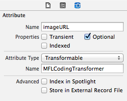

MFLCodingTransformer
====================

A simple NSValueTransformer which can serialize any NSCoding compatible objects.
Very useful for putting arbitary data inside Core Data models, such as NSURL.



```objective-c
NSValueTransformer *transformer = [[MFLCodingTransformer alloc] init];
NSData *value = [transformer transformedValue:[NSURL URLWithString:@"http://mentallyfriendly.com/"]];
```

## Installation

[CocoaPods](http://cocoapods.org) is the recommended way to add
MFLCodingFransformer to your project.

Here's an example podfile that installs MFLCodingTransformer.

### Podfile

```ruby
pod 'MFLCodingTransformer'
```

## Jobs

If you like what we're doing, be sure to check out our
[jobs page](http://mentallyfriendly.com/careers). We're hiring!

## License

MFLCodingTransformer is released under the BSD license. See [LICENSE](LICENSE).

